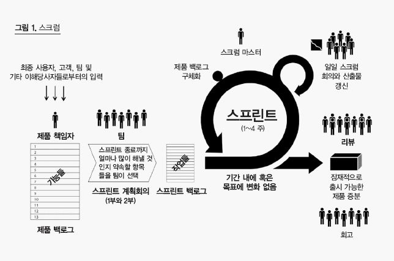

# 1.스크럼 팀
> ## 제품 책임자(PO ; Product Owner)
> - 요구사항이 담긴 백로그(Backlog)를 작성하는 주체이다
> - 이해관계자(소프트웨어 개발 의뢰자, 소프트웨어 개발자, 소프트웨어 사용자 등이다.)들 중에서 개발될 제품에 대한 **이해도가 높으며** **요구사항을 책임**지고 **의사를 결정**할 사람으로 선정됨
>
> ## 스크럼 마스터(SM ; Scrum Master)
> - 스크럼 팀이 **스크럼**을 잘 수행 할 수 있도록 **가이드**하는 역할을 수행한다. 
>
> ## 개발팀(DT ; Development Team)
> - 제품 책임자(PO)와 스크럼 마스터(SM)를 제외한 모든 팀원이다.
> - 제품을 개발하는 역할을 수행함.

# 2. 스크럼 개발 프로세스
> ## 스프린트 계획 회의(Sprint Planning Meeting)
> - 제품 백로그(Backlog) 중 이번 스프린트에서 수행할 작업을 대상으로 단기 일정을 수립하는 회의를 뜻한다.
>
> ## 스프린트(Sprint)
> - 실제 개발 작업을 진행하는 과정이다.
> - 1 - 4주 정도의 기간내에서 진행한다.
>
> ## 일일 스프린트 회의(Daily Scrum Meeting)
> - 모든 팀원이 매일 약속된 시간에 약 15분 동안 진행 상황을 점검하는 회의.
> - 남은 작업 시간은 소멸 차트(Burn-down Chart)에 표시한다.
>
> ## 스프린트 검토 회의(Sprint Review)
> - 부분 또는 전체 완성 제품이 요구사항에 잘 부합하는지 테스팅하는 회의.
>
> ## 스프린트 회고(Sprint Retrospective)
> - 정해놓은 규칙 준수 여부 및 개선할 점을 확인하고 기록하는 것.
>
> ## 스크럼 개발 프로세스 이미지
> 