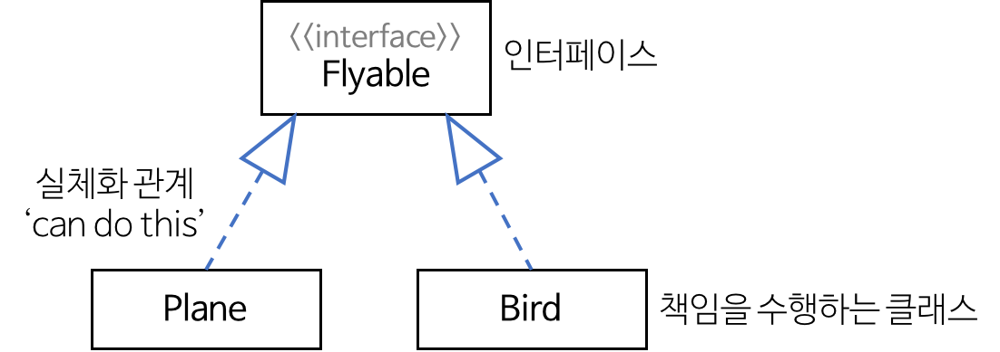

# 1. UML(Unified Modeling Language)
> - 시스템 분석, 설계, 구현 등 시스템 개발 과정에서 시스템 개발자와 고객 또는 개발자 상호 간의 의사소통이 원할하게 이루어지도록 표준화한 대표적인 객체지향 모델링 언어이다.
> - Rumbaugh(OMT), Booch, Jacobson 등의 객체지향 방법론의 장점을 통합하였다.
> - OMG(Object Management Group)에서 표준으로 지정하였다.
> **UML의 구성 요소**
>   - 사물(Things)
>   - 관계(Relationships)
>   - 다이어그램(Diagram)

# 2. 사물(Things)
> - 사물은 다이어그램 안에서 관계를 형성될 수 있는 대상들을 말한다.
> - 모델을 구성하는 가장 중요한 기본 요소이다.
>
> 

# 3. 관계(Relationships)
> - 사물과 사물 사이의 연관성을 표현하는 것
> - **관계의 종류**
>   - 연합 관계
>   - 집합 관계
>   - 포함 관계
>   - 의존 관게
>   - 일반화 관계
>   - 실체화 관계
> ## 연관 관계(Association Relationship)
> - 2개 이상의 사물이 서로 관련되어 있는 관계.
> - 사물 사이를 실선으로 연결하여 표현.
> - 방향성은 화살표로 표현한다.
> - 양방향 관계의 경우 화살표를 생략하고 실선으로만 연결하여 표현한다다.
> - **다중도를 선 위에 표기한다.**

|다중도|의미|
|:---:|:---|
|1|1개의 객체가 연관되어 있음|
|n|n개의 객체가 연관되어 있음|
|0..1|연관된 객체가 없거나 1개만 존재함|
|0..* 또는 *|연관된 객체가 없거나 다수일 수 있음|
|1..*|연관된 객체가 적어도 1개 이상임|
|n..*|연관된 객체가 적어도 n개 이상임|
|n..m|연관된 객체가 최소 n부터 최대 m개임|

> ## 의존 관계(Dependency Relationship)
> - 연관 관계와 같이 사물 사이에 서로 연관이 있으나 필요에 의해 서로에게 영향을 주는 짧은 시간 동안만 연관을 유지하는 관계.
> - 하나의 사물과 다른 사물이 소유 관계는 아니지만 사물의 변화가 다른 사물에도 영향을 미치는 관계.
> - 영향을 주는 사물(이용자)이 영향을 받는 사물(제공자) 쪽으로 점선 화살표를 연결하여 표현한다.
>
> ## 집합 관계(집약 관계 : Aggregation Relationship)
> - 하나의 사물이 다른 사물에 포함되어 있는 관계.
> - 포함하는 쪽(전체 : Whole)과 포함되는 쪽(부분 : Part)은 서로 독립적이다.
> - 포함되는 쪽(부분 : Part)에서 포함하는 쪽(전체 : Whole)으로 속이 빈 마름모를 연결하여 표현한다.
>
>   
>
> ## 포함 관계(Composition Relationship)
> - 집합 관계의 특수한 형태로, 포함하는 사물의 변화와 사물에게 영향을 미치는 관계.
> - 포함하는 쪽(전체 : Whole)과 포함되는 쪽(부분 : Part)은 서로 독립될 수 없고 생명주기를 함께한다.
> - 포함되는 쪽(부분 : Part)에서 포함하는 쪽(전체 : Whole)으로 속이 채워진 마름모를 연결하여 표현한다.
>
>   
>
> ## 일반화 관계(Generalization Relationship)
> - 하나의 사물이 다른 사물에 비해 더 일반적이거나 구체적인 관계.
> - 보다 일반적인 개면을 상위(부모), 보다 구체적인 개념을 하위(자식)라고 부른다
> - 구체적(하위)인 사물에서 일반적(상위)인 사물 쪽으로 속이 빈 화살표를 연결하여 표현한다.
>
>   
>
> ## 실체화 관계(Realization Relationship)
> - 사물이 할 수 있거나 해야 하는 기능으로, 서로를 그룹화 할 수 있는 관계
> - 사물에서 기능 쪽으로 속이 빈 점선 화살표를 연결하여 표현한다.
>
>   

# 4. 다이어그램(Diagram)
> ## 구조적 다이어그램(Class Diagram)
> - [클래스 다이어그램(Class Diagram)](./1_요구사항_확인/UML_클래스_다이어그램.md)
> - 객체 다이어그램(Object Diagram)
> - 컴포넌트 다이어그램(Component Diagram)
> - 배치 다이어그램(Deployment Diagram)
> - 복합체 구조 다이어그램(Composite Structure Diagram)
> - [패키지 다이어그램(Package Diagram)](./1_요구사항_확인/UML_패키지_다이어그램.md)
>
> ## 행위 다이어그램(Behavialoral Diagram)
> - [유스케이스 다이어그램(Use Case Diagram)](./1_요구사항_확인/UML_유스케이스_다이어그램.md)
> - [순차 다이어그램(Sequence Diagram)](./1_요구사항_확인/UML_순차_다이어그램.md)
> - 커뮤니케이션 다이어그램(Communication Diagram)
> - 상태 다이어그램(State Diagram)
> - 활동 다이어그램(Activity Diagram)
> - 상호작용 개요 다이어그램(Interaction Overview Diagran)
> - 타이밍 다이어그램(Timing Diagram)
>
> ## 스테레오 타입(Stereotype)
> - `<<include>>` : 연결된 다른 UML 요소에 대해 포함 관계에 있는 경우
> - `<<extends>>` : 연결된 다른 UML 요소에 대해 확장 관계에 있는 경우
> - `<<interface>>` : 인터페이스를 정의하는 경우
> - `<<exception>>` : 예외를 정의하는 경우
> - `<<constructor>>` : 생성자 역할을 수행하는 경우우