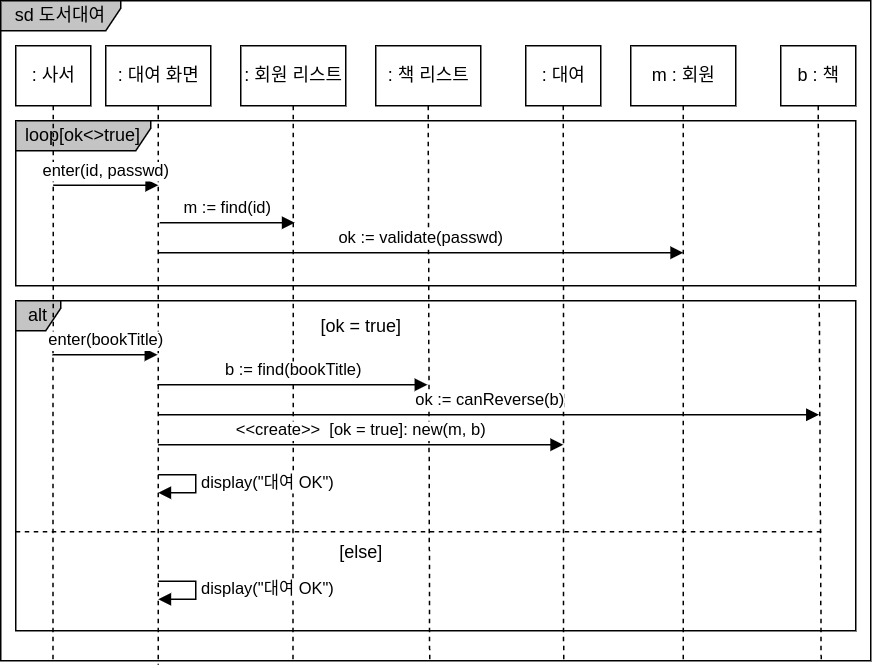

# 1. 동적 모델링
> - 시스템의 내부 구성 요소들의 상태 변화 과정돠 과정에서 발생하는 상호 작용을 표현한 것
> - 시스템 내부 구성 요소들 간에 이루어지는 동작이라는 관점(View)에서 표현
> - **동적 모델링의 종류**
>   - 순차 다이어그램(Sequence Diagram)
>   - 커뮤니케이션 다이어그램(Communication Diagram)
>   - 상태 다이어그램(State Diagram)

# 2. 순차(Sequence) 다이어그램
> - 시스템이나 객체들이 메시지를 주고받으며 상호작용하는 과정을 그림으로로 표현한 것
> - 시스템이나 객체들의 상호작용 과정에서 주고받는 메시지를 표현한다.
> - 각 동작에서 참여하는 객체들을 기본 단위로 하여 그들의 상호 작용을 표현한다.

# 3. 순차 다이어그램의 구성 요소
> 