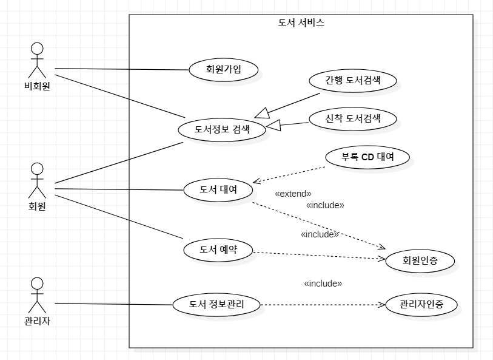
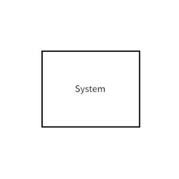
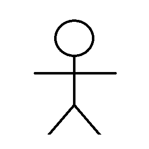
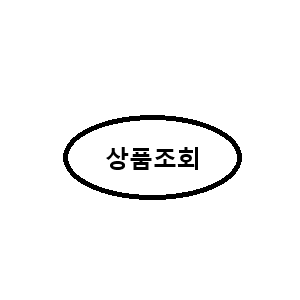
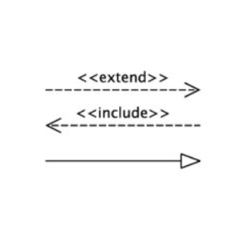

# 1. 기능 모델링
> - 기능 모델링은 사용자의 요구사항을 분석한다.
> - 개발될 시스템이 갖춰야 할 기능을 정리한 뒤, 사용자와 함께 정리된 내용을 공유하기 위해 그림으로 표현하는 것.
> - **기능 모델링 종류**
>   - 유스케이스(Use Case) 다이어그램
>   - 액티비티(Activity) 다이어그램

# 2. 유스케이스(Use Case) 다이어그램
> - 사용자와 다른 외부 시스템들이 개발될 시스템을 이용해 **수행할 수 있는 기능**을 **사용자의 관점에서 표현**한 것
> - 외부 요소와 시스템 간의 상호 작용을 확인할 수 있다.
> - 사용자의 요구사항을 분석하기 위한 도구로 사용한다.

# 3. 유스케이스(Use Case) 다이어그램의 구성 요소
> 
>
> |구성 요소|표현 방식|내용|
> |:---:|:---:|:---|
> |시스템(System)   시스템 범위(System Scope)||시스템 내부의 유스케이스들을 사각형으로 묶어 시스템의 범위를 표현한 것|
> |액터(Actor)| 주액터      부액터    | - 시스템과 상호작용을 하는 모든 외부 요소   - 주로 사람이나 외부 시스템을 의미함   - 주액터 : 시스템을 사용함으로써 이득을 얻는 대상으로 주로 사람이 해당함   - 부액터 : 주액터의 목적 달성을 위해 시스템에 서비스를 제공하는 외부 시스템|
> |유스케이스(Use Case)||사용자가 보는 관점에서 시스템이 액터에게 제공하는 서비스나 기능|
> |관계(Relationship)|| - 관계는 액터와 유스케이스, 유스케이스와 유스케이스 사이에서 나타남   - 유스케이스에서 나타날 수 있는 관계 : 포함(include) 관계, 확장(extends) 관계, 일반화(Generalization) 관계|