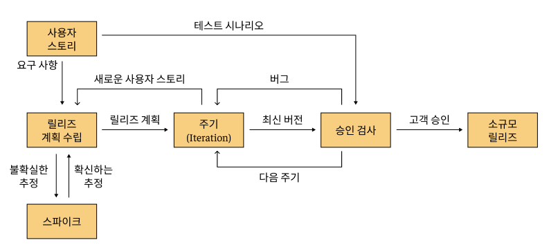

# 1. XP(eXtreme Programming)
> - 고객의 **요구사항에 유연하게 대응**하기 위해 **고객의 참여**와 **개발 과정의 반복**을 **극대화**하여 개발 생산성을 향상하는 방법.
> - 짧고 반복적인 개발 주기, 단순한 설계, 고객의 적극적 참여
> - 릴리즈의 기간을 짧게 반복하면서, 고객의 요구사항 반영에 대한 가시성(소프트웨어의 일부 기능이 구현 될 때마다 고객에게 이를 확인 시켜줌)을 높임.
> - 5가지 핵심 가치
>   - 의사소통(Communication)
>   - 단순성(Simplicity)
>   - 용기(Courage)
>   - 존중(Respect)
>   - 피드백(Feedback)

# 2. XP 개발 프로세스
> ## 릴리스 계획 수립(Release Planning)
> - 부분 혹은 전체 개발 완료 시점에 대한 일정 수립
> - 몇 가지의 스토리가 적용되어, 부분적으로 기능이 완료된 제품을 제공하는 것이 릴리스다.
>
> ## 이터레이션(주기 : Iteration)
> - 실제 개발 작업을 진행하는 과정
> - 보통 1~3주 정도의 기간으로 진행됨
>
> ## 승인 검사(인수 테스트 : Acceptance Test)
> - 하나의 이터레이션(주기) 안에서 부분 완료 제품이 구현되면 수행하는 테스트
>
> ## 소규모 릴리스(Small Release)
> - 요구사항에 유연하게 대응할 수 있도록 릴리스 규모를 축소한 것
>
> ## 스파이크(Spike)
> - 요구사항의 신뢰성을 높이고 기술 문제에 대한 위험 감소시키기 위해 만드는 간단한 프로그램램
>
> ## XP 개발 프로세스 이미지
> 

# 3.XP의 주요 실천 방법(Practice)
> ## 짝 프로그래밍(Pair Programming)
> - 다른 사람과 함께 프로그래밍을 수행함으로써 개발에 대한 책임을 공동으로 나눠 갖는 환경 조성
>
> ## 공동 코드 소유(Collective Ownership)
> - 개발 코드에 대한 권한과 책임을 공동으로 소유함
>
> ## 테스트 주도 개발(Test-Driven Development)
> - 개발자가 실제 코드를 작성하기 전에 테스트 케이스를 먼저 작성하므로 자신이 무엇을 해야할지를 정확히 파악
> - 테스트가 지속적으로 진행될 수 있도록 자동화된 테스팅 도구(구조, 프레임워크)를 사용함.
>
> ## 전체 팀(Whole Team)
> - 개발에 참여하는 모든 구성원(고객 포함)들은 각자 자신의 역할이 있고 그 역할에 대한 책임을 가진다.
>
> ## 계속적인 통합(Continuous Integration)
> - 모듈 단위로 개발된 코드들은 하나의 작업이 마무리 될때마다 지속적으로 통합됨.
>
> ## 리팩토링(Refactoring)
> - 프로그램 기능의 변경 없이 시스템을 재구성함
> - 목적 : 프로그램을 쉽게 이해하고 쉽게 수정하여 빠르게 개발할 수 있도록 함
>
> ## 소규모 릴리스(Small Releases)
> - 릴리즈 기간을 짧게 반복함으로써 고객의 요구 변화에 신속히 대응할 수 있다.
