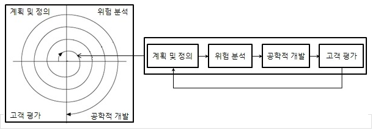

# 1. 폭포수 모형형(고전적 생명 주기 모형 : Waterfall Model)
> 이전 과정으로 돌아갈 수 없다는 전제하에, **각 단계를 확실하게 매듭짓고** 그 결과를 **철저하게 검토**하여 **승인 과정을 거친 후에 다음 단계를 진행**하는 개발 방법론이다. 각 단계가 끝난 후에는 다음 단게를 수행하기 위한 결과물이 명확하게 산출되어야 한다. 
>
> 가장 오랬동안 사용되어 왔고 가장 폭넓게 사용된 전톡적 소프트웨어 생명 주기 모델이다. 

# 2. 프로토타입 모형(원형 모형 : Prototype Model)
> 사용자의 요구 사항을 파악하기 위해서 **실제 개발될 소프트웨어**의 **견본품(Prototype)** 을 만들어서 최종 결과물을 예측하는 모델이다.
>
> 단, 견본품(Prototype)은 사용자와 시스템 사이의 인터페이스 중점으로 개발된다.

# 3. 나선형 모형(점진적 모형 : Spiral Model)
> 제안자 : 보헴(Boehm)
>
> 나선형 모양을 따라 돌며 여러 번의 소프트웨어 개발과정을 거치면서 점진적으로 완벽한 소프트웨어를 개발하는 모형이다.
>
> 폭포수 모형의 체계적인 단계별 접근과 체계적인 관리와 통제로 완료 기준과 검토 과정을 가져왔다. 
>
> 프로토타입 모형의 여러차례 프로토타입을 개발하여 요구사항을 구체화하고 초기에 핵심 기능의 프로토타입을 개발하여 위험 분석을 한다.
>
> 이로 인해 두 모형의 장점만을 가져와서 사용자의 요구사항과 누락된 요구사항을 유연하게 첨가할 수 있으며 점진적으로 구체화를 하여 소프트웨어를 개발한다. 
>
> 4가지 구요 활동은 계획 수립 -> 위험 분석 -> 개발 및 검증 -> 고객 평가의 반복이다. 
> 
> 

# 4. 애자일 모형(Agile Model)
> 애자일은 '민첩한'이란 뜻으로, 고객의 **요구사항 변화에 유연하게 대응**하고 **일정 주기를 반복**하여 개발하는 모형이다.
>
> 어느 특정 개발 방법론이 아닌, 좋은 것을 빠르고 낭비 없게 만들기 위해 고객과 소통을 초점으로 맞춘 방법론으로 통칭된다. 
>
> 대표적으로 **스크럼(Scrum)**, **XP(eXtreme Programming)**, **칸반(Janban)**, **Lean**, **기능 중심 개발(FDD ; Feature Driven Development)** 가 있다.
>
> 애자일 개발 4가지 핵심 가치
> - 프로세스와 도구보다는 **개인과의 상호작용**에 더 가치를 둠
> - 방대한 문서보다는 **실행되는 소프트웨어**에 더 가치를 둠
> - 계약과 협상보다는 **고객과 협업**에 더 가치를 둠
> - 계획을 따르기 보다는 **변화에 반응**하는 것에 더 가치를 둠