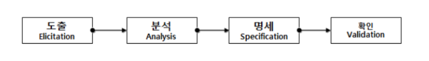

# 1. 요구사항 개발 프로세스
> - 개발 대상에 대한 요구사항을 체계적으로 **도출**하고 **분석**한다.
> - **명세**서에 정리한 다음, **확인 및 검증**하는 일련의 구조화된 활동.
>
> 

# 2. 요구사항 도출(요구사항 수집 : Requirement Elicitation)
> - 시스템, 사용자, 개발자 등의 시스템 개발에 관련된 사람들이 서로 의견을 교환하여 요구사항을 어떻게 수집할지 식별하고 이해하는 과정.
> - 개발자와 고객 사이의 관계가 만들어지고 **이해관계자(Stakeholder)**가 식별된다.
> - 소프트웨어 개발 생명 주기(SDLC) 동안 지속적으로 반복된다.
> - **요구사항을 도출하는 주요 기법**
>   - 청취와 인터뷰
>   - 설문
>   - 브레인스토밍
>   - 워크샵
>   - 프로토타이핑
>   - 유스케이스

# 3. 요구사항 분석(Requirement Analysis)
> - 개발 대상에 대한 사용자의 요구사항 중 **불명확, 모호한, 이해되지 않는 부분**을 발견하고 이를 걸러내기 위한 과정이다.
> - 요구사항의 타당성을 조사하고 비용과 일정에 대한 제약을 설정한다.
> - 서로 상충되는 요구사항이 있으면 이를 중재하는 과정이다.
> - **요구사항을 분석하는 주요 도구**
>   - [자료 흐름도(DFD)](./1_요구사항_확인/요구사항_분석.md)
>   - [자료 사전(DD)](./1_요구사항_확인/요구사항_분석.md)

# 4. 요구사항 명세(Requirement Specification)
> - 분석된 요구사항을 바탕으로 모델을 작성하고 문서화하는 것을 의미.
> - [기능 요구사항](./1_요구사항_확인/요구사상_정의.md)을 빠짐없이 기술한다.
> - [비기능 요구사항](./1_요구사항_확인/요구사상_정의.md)은 필요한 것만 기술한다.
> - 구체적인 명세를 위해 소단위 명세서(Mini-Spec)가 사용될 수 있다.

# 5. 요구사항 확인(요구사항 검증 : Requirement Validation)
> - 개발 자원을 요구사항에 할당하기 전에 요구사항 명세서가 정확하고 완전하게 작성되었는지를 검토하는 활동이다.
> - **이해관계자(Stakeholder)**들이 검토를 해야한다.
> - 요구사항 관리 도구를 이용하여 요구사항 정의 문서들에 대해 형상 관리(SDM)를 수행한다.
> - **형상 관리(SDM ; Software Configuration Management)**
>   - 소프트웨어 개발 단계의 각 과정에서 만들어지는 **프로그램, 프로그램을 설명하는 문서, 데이터**을 통칭히야 **형상**이라 한다.
>   - **형상**들의 변경 사항을 관리하는 일련의 활동을 **형상관리(SDM)**라고 한다.

# 6. 요구사항 명세 기법
|구분|정형 명세 기법|비정형 명세 기법|
|:---:|:---|:---|
|기법|수학적 원리 기반, 모델 기반|상태/기능/객체 중심|
|작성방법|수학적 기호, 정형화된 표기법|일반 명사,동사 등의 자연어를 기반으로 서술 또는 다이어그램으로 작성|
|특징| - 요구사항을 정확하고 간결하게 표현할 수 있음    - 요구사항에 대한 결과가 작성자에 관계없이 일관성이 있으므로 완전성 검증이 가능함| - 자연어의 사용으로 인해 요구사항에 대한 결과가 작성자에 따라 다를 수 있어 일관성이 떨어지고, 해석이 달라질 수 있음    - 내용의 이해가 쉬어 의사소통이 용이함|
|종류| VDM, Z, Petri-net, CSP 등| FSM, Decision Table, ER모델링, State Chart(SADT) 등|