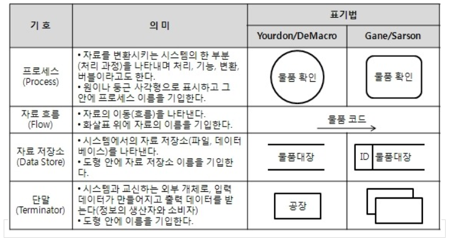
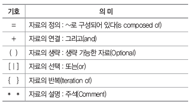

# 1. 요구사항 분석
> - 개발 대상에 대한 사용자의 요구사항을 이해하고 문서화하는 활동
> - 사용자의 요구의 타당성을 조사하고 비용과 일정에 대한 제약을 설정한다.
> - 사용자의 요구를 정확하게 추출하여 목표를 정한다.

# 2. 구조적 분석 기법
> - 자료의 흐름과 처리를 중심으로 하는 요구사항 분석 방법.
> - 도형 중심의 분석용 도구와 분석 절차를 이용하여 사용자의 요구사항을 파악하고 문서화한다.
> - 하향식 방법을 사용하여 시스템을 세분화할 수 있다.
> - 분석의 중복을 배제할 수 있다.
> - **주요 구조적 분석 기법 도구**
>   - 자료 흐름도(DFD)
>   - 자료 사전(DD)
>   - 소단위 명세서(Mini-Spec)
>   - 개체 관계도(ERD)
>   - 상태 전이도(STD)
>   - 제어 명세서

# 3. 자료 흐름도(DFD ; Data Flow Diagram)
> - 요구사항 분석에서 **자료의 흐름** 및 **변환 과정**과 기능을 **도형 중심으로 기술**하는 방법
> - 자료 흐름 그래프, 버블 차트
> - 자료 흐름과 처리를 중심으로 하는 구조적 분석 기법에 이용
>
> 

# 4. 자료 사전(DD ; Data Dictionary)
> - 자료 흐름도(DFD)에 있는 자료를 더 **자세히 정의**하고 **기록**한 것
> - 데이터를 설명하는 데이터로, 데이터의 데이터 또는 메타 데이터(Meta Data)라고 한다.
>
> 