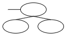

# 1. E-R(개체-관계 : Entiy-Relationship) 모델
> - 개체와 개체 간의 관계를 기본 요소로 이용하여 현실 세계의 무질서한 데이터를 개념적인 논리 데이터로 표현하기 위한 방법

# 2. E-R 다이어그램
|기호|기호 이름|의미|
|:---:|:---|:---|
||사각형|개체(Entity) 타입|
||마름모|관계(Relationship) 타입|
||타원|속성(Attribute)|
||이중타원|다중값 속성(복합 속성)||
||밑줄타원|기본키 속성|
||복수타원|복합 속성 (ex : 성명은 성과 이름으로 구성)|
||관계|1:1.1:N,N:M 등의 개체간 관계에 대한 대응수를 선 위에 기술함|
||선|개체 타입과 속성을 연결|
