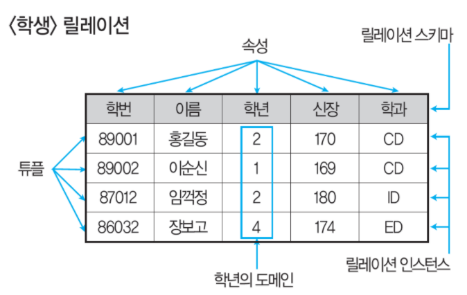

# 1. 관계형 데이터베이스의 릴레이션 구조
> - 릴레이션(Relation)은 데이터들을 표(Table)의 형태로 표현한 것.
> - 구조를 나타내는 릴레이션 스키마와 실제 값들인 릴레이션 인스턴스로 구성된다. 
> 

# 2. 튜플(Tuple)
> - 릴레이션을 구성하는 각각의 행.
> - **카디널리티(Cardinality)** : 튜플의 수, 기수, 대응수라고 한다.

# 3. 속성(Attribute)
> - 데이터베이스를 구성하는 가장 작은 논리적 단위.
> - **디그리(Degree)** : 속성의 수, 차수라고한다.

# 4. 도메인(Domain)
> - 하나의 애트리뷰트가 취할 수 있는 같은 타입의 원자(Atomic)값들의 집합
> - 도메인은 **속성(Attribute)** 값이 나타날 떄 그 값의 합볍 여부를 시스템이 검사하는데 이용

# 5. 릴레이션 특징
> - 똑같은 튜플이 포함될 수 없으므로 릴레이션에 포함된 튜플들은 모두 상이하다.
> - 한 릴레이션의 포함된 튜플 사이에는 순서가 없다.
> - 튜플들의 삽입, 삭제 등의 작업으로 인해 릴레이션은 시간에 따라 변한다.

