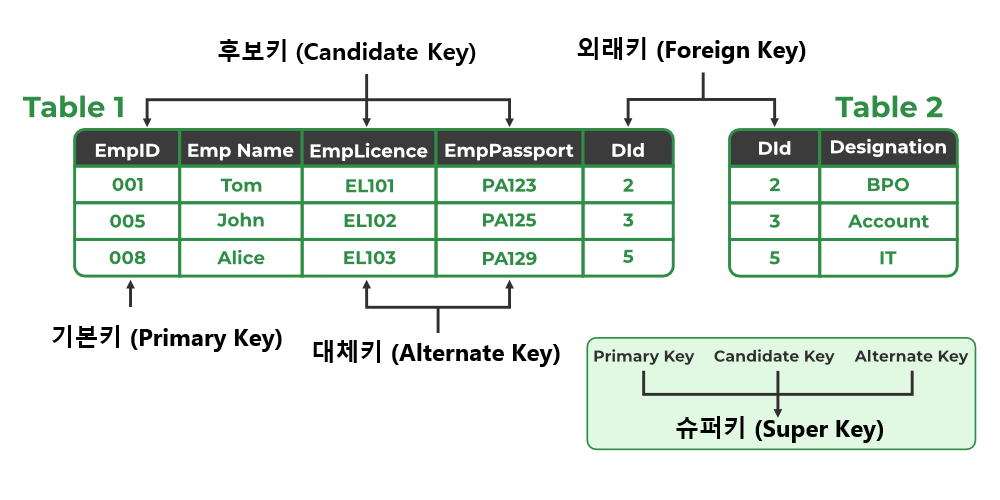

# 1. 키(Key)
> - **키의 종류**
>   - 후보키(Candidate Key)
>   - 기본키(Primary Key)
>   - 대체키(Alternate Key)
>   - 슈퍼키(Super Key)
>   - 외래키(Foreign Key)

# 2. 후보키(Candidate Key)
> - 릴레이션을 구성하는 속성들 중에서 튜플을 유일하게 식별하기 위해 사용되는 속성들의 부분집합

| 특성 | 설명 |
|:---:|:---|
|유일성(Unique)|하나의 키 값으로 하나의 튜플만을 유일하게 식별할 수 있어야 함|
|최소성(Minimality)|키를 구성하는 속성 하나를 제거하면 유일하게 식별할 수 없도록 꼭 필요한 최소성을 구성되어야 함|

# 3. 기본키(Primary Key)
> - 후보키 중에서 특별히 선정된 주키(Main Key)
> - 중복값을 가질 수 없음

# 4. 대체키(Alternate Key)
> - 후보키가 둘 이상일 때 기본키를 제외한 나머지 후보키를 의미

# 5. 슈퍼키(Super Key)
> - 속성들의 집합으로 구성된 키
> - 릴레이션을 구성하는 모든 튜플 중 슈퍼키로 구성된 속성의 집합과 동일한 값은 나타나지 않음

# 6. 외래키(Foreign Key)
> - 다른 릴레이션의 기본키를 참조하는 속성 또는 속성들의 집합
> - 한 릴레이션에 속한 속성 A와 참조 릴레이션의 기본키인 B가 동일한 도메인상에서 정의 되었을때 속성 A를 외래키라 부름