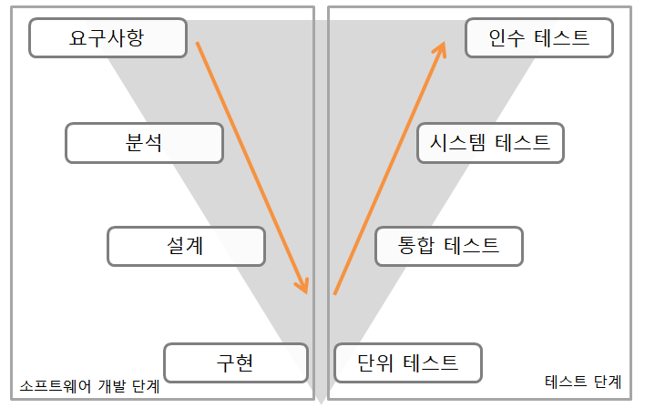

# 1. 개발 단계에 따른 애플리케이션 테스트

# 2. 단위 테스트
> - 코딩 직후 소프트웨어 설계의 최소 단위인 모듈이나 컴포넌트에 초점에 맞춰 테스트하는 것

# 3  통합 테스트
> - 단위 테스트가 완료된 모듈들을 결합하여 하나의 시스템으로 완성시키는 과정에서의 테스트

# 4. 인수 테스트
> - 개발한 소프트웨어가 사용자의 요구사항을 충족하는지에 중점을 두고 테스트 하는 방법
> - **알파 테스트** : 개발자의 장소에서 사용자가 개발자 앞에서 행하는 테스트 기법
> - **베타 테스트** : 선정된 최종 사용자가 여러 명의 사용자 앞에서 행하는 테스트 기법

